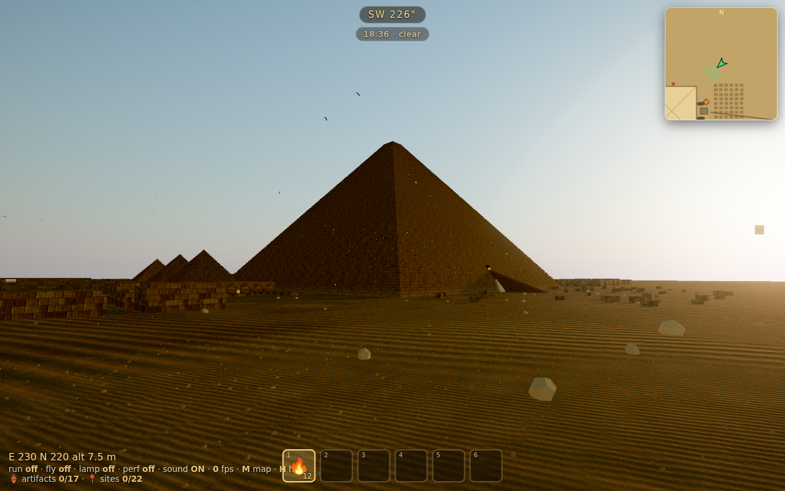
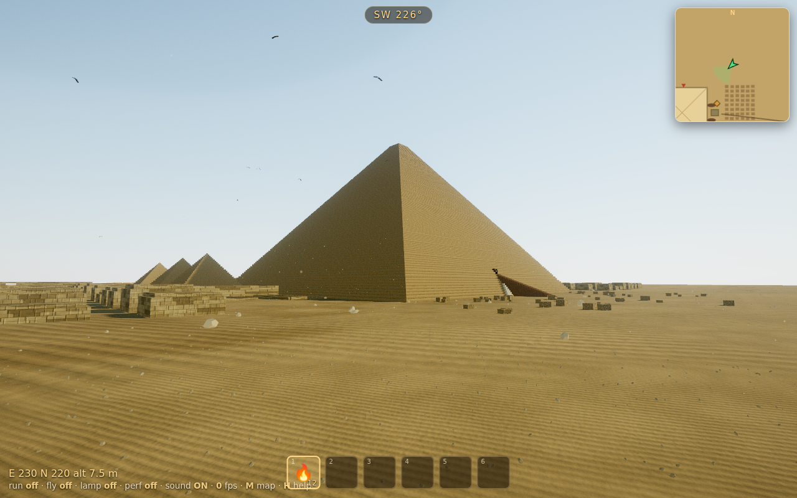

# The Giza Plateau — To-Scale Explorable Simulation

A browser-based, **1:1 scale**, fully playable 3D reconstruction of the Giza
Plateau with **physics-based first-person exploration**. Every monument is
built from real survey data, and the pyramids are **explorable inside** with
authentic passage systems and chambers.




## Run it

This is a static site (Three.js via CDN). It must be served over HTTP because
it uses ES modules + an import map — opening `index.html` from `file://` will
not work.

```bash
# any of these, from the project root:
npx serve -l 8080 .        # Node
python3 -m http.server 8080 # Python
```

Then open <http://localhost:8080>.

## Controls

| Key | Action |
| --- | --- |
| `W A S D` / arrows | Move |
| Mouse | Look (click to capture the pointer) |
| `Space` | Jump (or ascend while flying) |
| `Shift` | Sprint |
| `C` / `Ctrl` | Descend while flying |
| `F` | Toggle **fly / no-clip** (great for covering the 230 m pyramids) |
| `L` | Toggle **headlamp** (needed inside the passages) |
| `M` | **Fast-travel** menu (entrances, King's/Queen's/Subterranean Chambers, Sphinx…) |
| `H` | Help / real-world facts |
| `Esc` | Release the mouse |

**On phones/tablets** (no pointer lock): tap **Tap to start**, then use the
on-screen **joystick** (left) to move, **drag** anywhere on the right to look,
and the **JUMP / RUN / FLY / LAMP / MAP** buttons. A compass shows your heading,
and your **headlamp turns on automatically** whenever you go inside a pyramid.

## What's modelled

**To scale, from real GPS-derived relative positions:**

- **Great Pyramid of Khufu** — base 230.4 m, original height 146.6 m, face
  slope 51°50′.
  - Full interior: original north-face entrance (~17 m up, reached by a stair) →
    **Descending Passage** → **Ascending Passage** → **Grand Gallery**
    (46.7 m long, 8.6 m tall) → **King's Chamber** (red granite, 10.47 × 5.23 m
    with the granite sarcophagus). Branches lead to the **Queen's Chamber**
    (gabled roof) and the **Subterranean Chamber** cut into the bedrock.
- **Pyramid of Khafre** — base 215.25 m, slope 53°, with surviving casing
  near the apex; descending passage to a burial chamber.
- **Pyramid of Menkaure** — base 102.2 m, with its red-granite lower courses;
  descending passage to a burial chamber.
- **Subsidiary "queens'" pyramids** of Khufu and Menkaure.
- **The Great Sphinx** — 73 m long, 20 m high, facing due east — plus the
  Sphinx (Valley) Temple and the mortuary temples east of each pyramid.
- A weathered desert plateau, late-afternoon physical sky, sun shadows, and
  scattered fallen casing blocks.

### Notes on accuracy

- Monument **positions, sizes, orientations and slope angles** are accurate.
- Interior **passage cross-sections are slightly enlarged** (≈1.6 m wide,
  2.2 m tall) so you can walk them upright. The real passages are ~1.0–1.2 m
  and require crouching — the genuine dimensions are listed in the in-game
  **H**elp panel.
- Geometry is procedural (no external 3D assets), so blocks and reliefs are
  suggested with textures rather than individually modelled.

## Tech

- [Three.js](https://threejs.org) for rendering (WebGL).
- [three-mesh-bvh](https://github.com/gkjohnson/three-mesh-bvh) for fast
  capsule-vs-mesh collision (collide-and-slide character physics).
- No build step — plain ES modules loaded from a CDN via an import map.

## Project layout

```
index.html         # import map, UI overlays
styles/main.css    # HUD / menu styling
js/data.js         # survey data: dimensions, positions, interior layout
js/materials.js    # procedural stone / sand textures + materials
js/builders.js     # geometry: pyramid faces, tunnels, rooms, stairs, sarcophagi
js/world.js        # assembles the plateau, terrain, sky and lighting
js/player.js       # collider/BVH build + capsule character controller
js/main.js         # bootstrap, input, HUD, fast-travel, game loop
test/headless.mjs  # Node smoke test for the geometry/physics build
```

## Test

```bash
npm install   # dev-only: three + three-mesh-bvh for the headless test
npm test      # builds the whole world + collider and runs physics frames
```
